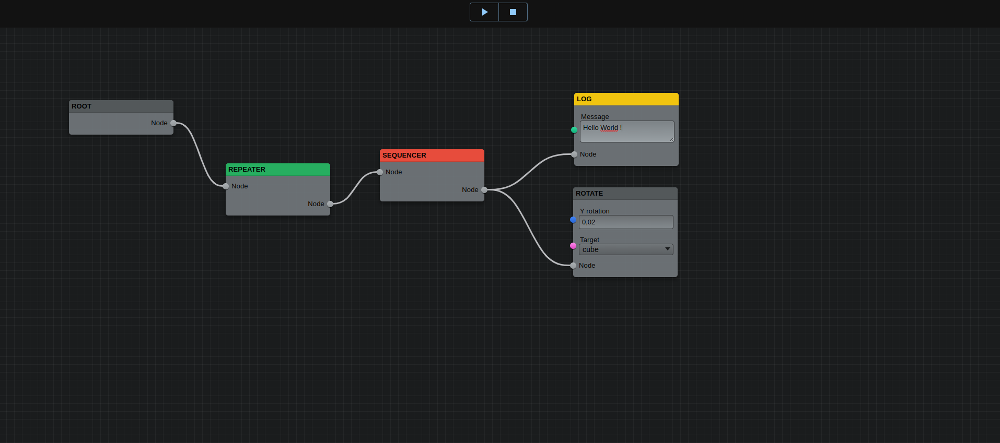

# Three Blueprint

This project is just a POC for 3D blueprint with react-flume and three.js

 

## Why this project ?

Because I'm passionate about video-games development and I wanted to try to develop a system like Unreal Engine BP ( in some way :) ) and with basic features !

 

## Wait, I know flume and you didn't use the RootEngine ?!

Yes and yes !
Indeed, there is a logic Engine on Flume to help you to implements your logic based on your nodes using the editor ([see here](https://flume.dev/docs/RootEngine)).

But, as you know, developers are some weird peoples, and I wanted to try to implements my own logic for nodes just for... challenges yo know !